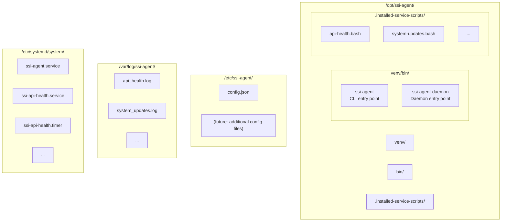
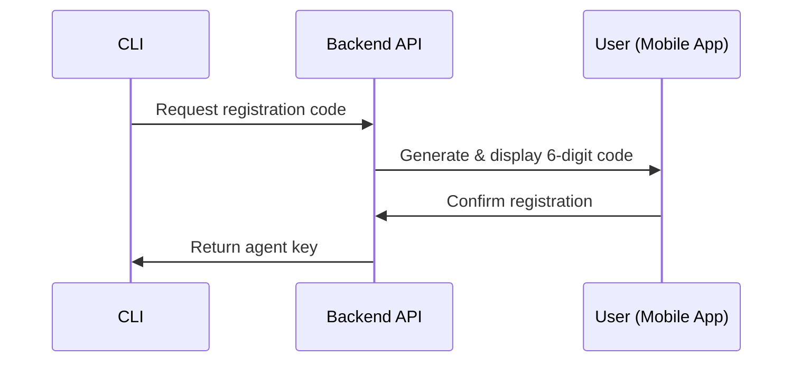

# Architecture

## System Overview

The SSI Agent operates as a systemd-native monitoring daemon on Linux systems. It consists of three main components:

1. **CLI Tool** (`ssi`) — For user interaction and configuration
2. **Daemon** (`ssi-agent-daemon`) — Long-running process for backend communication
3. **Service Scripts** — BASH scripts managed by systemd

```mermaid
flowchart TB
    SB["SSI Backend<br/>(WebSocket)"]

    subgraph LS["Linux System"]
        CLI["User<br/>(ssi CLI)"]
        subgraph AD["SSI Agent Daemon"]
            direction TB
            AD1["- Watches log files"]
            AD2["- Sends status via WebSocket"]
            AD3["- Handles reconnection"]
        end

        ST["systemd timers"] --> LF["Log Files<br/><br/>/var/log/ssi-agent/&lt;service&gt;.log"]
        SS["Service Scripts<br/><br/>/opt/ssi-agent/.installed-service-scripts/*.bash"] --> LF

        CLI --> ST
        AD --> LF
        AD <--> SB
    end

    style AD fill:#2d3748,stroke:#4a5568
```



## Execution Model

### Daemon Mode

The SSI Agent daemon (`ssi-agent-daemon`) is a long-running systemd service that:

- Maintains a WebSocket connection to the backend
- Watches log files for changes using file system events
- Parses log entries and sends status updates
- Handles connection failures with exponential backoff

The daemon is managed by systemd:

```bash
# Service file: /etc/systemd/system/ssi-agent.service
systemctl status ssi-agent
systemctl restart ssi-agent
journalctl -u ssi-agent -f
```

### Timer-Based Execution

Service scripts are **not** executed by the daemon directly. Instead:

1. Each service script has a corresponding **systemd timer**
2. The timer triggers a **systemd service unit**
3. The service unit executes the BASH script
4. Script output is captured to log files
5. The daemon watches log files and reports changes

This design ensures:

- **Reliability**: systemd handles scheduling, timeouts, and restarts
- **Isolation**: Each script runs in its own process
- **Transparency**: Standard systemd tools work (`journalctl`, `systemctl`)

### Unit File Structure

For a service with ID `api_health`, the following files are created:

```
/etc/systemd/system/
├── ssi-api-health.service   # Executes the script
└── ssi-api-health.timer     # Schedules execution
```

**Service Unit** (`ssi-api-health.service`):

```ini
[Unit]
Description=Checks the health of an API
After=network.target

[Service]
Type=oneshot
ExecStart=/bin/bash -c '/opt/ssi-agent/.installed-service-scripts/api-health.bash'
TimeoutSec=10
StandardOutput=append:/var/log/ssi-agent/api-health.log
StandardError=append:/var/log/ssi-agent/api-health.log
```

**Timer Unit** (`ssi-api-health.timer`):

```ini
[Unit]
Description=Timer for API health check

[Timer]
OnCalendar=*:0/01:00
Persistent=true
RandomizedDelaySec=30

[Install]
WantedBy=timers.target
```

## Directory Structure



## Communication Flow

### Status Reporting


1. **Script executes** and prints to stdout:

   ```
   2024-01-15 10:30:00, OK, API is healthy
   ```

2. **systemd captures** output to log file:

   ```
   /var/log/ssi-agent/api-health.log
   ```

3. **Daemon detects** file change and parses the new line

4. **Daemon sends** status update via WebSocket:

   ```json
   {
     "service_id": "api-health",
     "status": "OK",
     "message": "API is healthy",
     "timestamp": "2024-01-15T10:30:00"
   }
   ```

5. **Backend receives** and broadcasts to connected clients

### Registration Flow



1. `ssi register` requests a registration code from the backend
2. Backend generates a 6-digit code and UUID pair
3. User enters the code in the mobile app
4. Mobile app confirms registration with backend
5. CLI polls for confirmation and receives agent key
6. Agent key is stored in `/etc/ssi-agent/config.json`

## Resource Constraints

| Resource | Expectation                                |
| -------- | ------------------------------------------ |
| CPU      | Minimal baseline, burst-only during checks |
| Memory   | < 50MB typical usage                       |
| Disk I/O | Read-only except logs and config           |
| Network  | Single WebSocket connection                |

## Failure Handling

### Fail-Fast (Fatal Errors)

The agent exits immediately on:

- Invalid or missing configuration
- Invalid authentication credentials
- Missing systemd dependency
- Corrupt persistent state

### Fail-Soft (Recoverable)

The agent retries with backoff on:

- Transient network failures
- Backend temporarily unavailable
- Individual script failures

## Security Model

### Agent Permissions

- Runs as dedicated `ssi-agent` user
- Read access to service scripts
- Write access to log directory
- Read/Write access to config directory

### Authentication

- Agent authenticates with a unique agent key
- Key is obtained during registration
- Key is stored securely in config file
- All communication uses TLS (WSS/HTTPS)

### Trust Model

- Agent is **semi-trusted** (limited permissions)
- Agent **cannot** modify backend configuration
- Agent **cannot** execute arbitrary remote commands
- Agent **can only** report status
